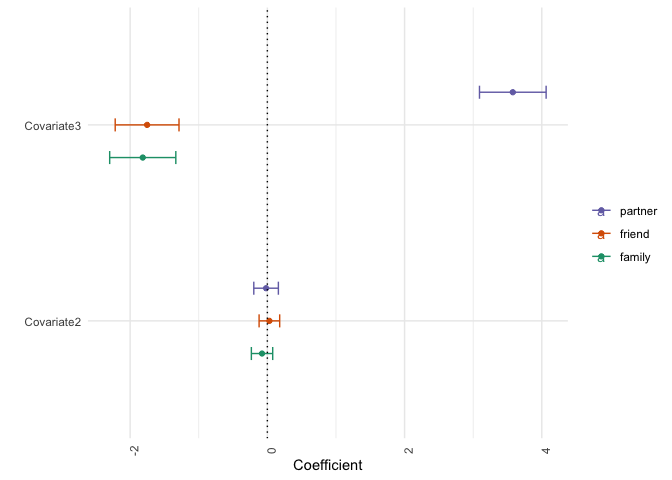
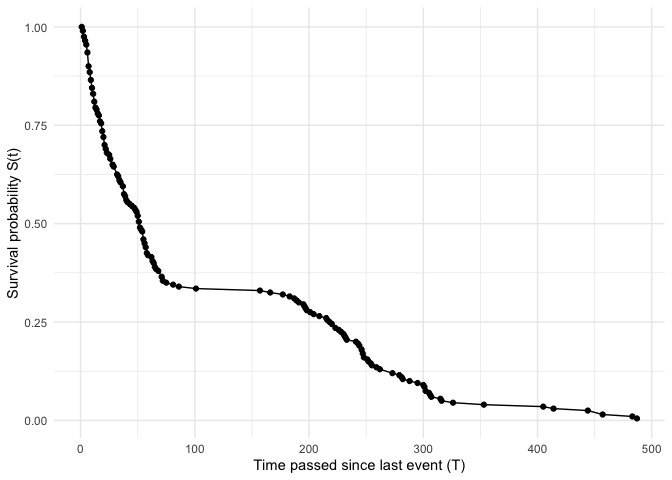
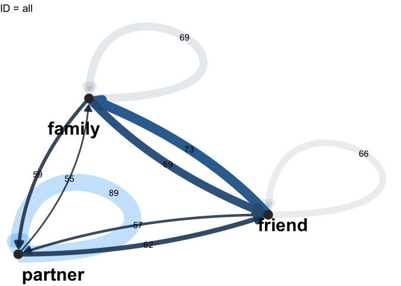
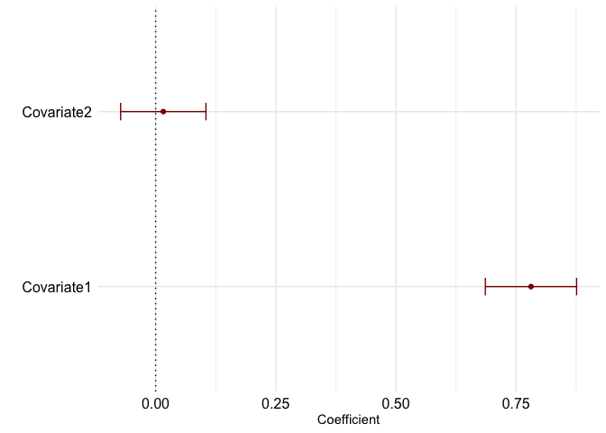

<!-- README.md is generated from README.Rmd. Please edit that file -->

# dena

<!-- badges: start -->
<!--
 -->


<!-- [](https://codecov.io/gh/timonelmer/dena?branch=master) -->
<!-- badges: end -->

`dena` is an R package that aids in preprocessing, modeling, and
visualization of categorical time-to-event data and egocentric social
network dynamics. This readme file will show you

1.  how to install and load the `dena` package
2.  examples of how `dena`can be used for preprocessing nested
    time-to-event data
3.  how to use `dena`’s wrapper functions to estimate competing
    multistate models
4.  examples of how `dena`can be used to visualize data and model
    results, for example:



## 1. Installation

You can install the development version of dena from
[GitHub](https://github.com/) with:

``` r
# install.packages("devtools")
devtools::install_github("timonelmer/dena")
```

`dena` can be loaded with the following function

``` r
library(dena)
```

## 2. Preprocessing functions

When analyzing (categorical) time-to-event data of multiple
participants, we enounter often data of the following format:

``` r
data(simdat2) # loading the example dataset

head(simdat2[,c(1,2,3,7,5)])
#>   id rep     time    type  Covariate1
#> 1  1   1 57.57392  friend  0.09038971
#> 2  1   2 73.51058  friend  0.34725614
#> 3  1   3 71.10374 partner -0.79411843
#> 4  1   4 61.15216 partner  0.29461076
#> 5  1   5 60.20567  family  1.23784134
#> 6  1   6 40.70458  family -0.04727337
```

with the `meanCenteringNested` function, we can mean center variables up
to three nesting layers (e.g., within participants, within burst, within
week).

``` r
simdat2 <- meanCenteringNested(dat = simdat2, 
                               vars = c("Covariate1","Covariate2"), 
                               nestVars = "id", 
                               verbose = F) 

head(simdat2[,c("id","Covariate1","Covariate1_id_MeanC","Covariate1_id_Mean")])
#>   id  Covariate1 Covariate1_id_MeanC Covariate1_id_Mean
#> 1  1  0.09038971         -0.03214716          0.1225369
#> 2  1  0.34725614          0.22471927          0.1225369
#> 3  1 -0.79411843         -0.91665530          0.1225369
#> 4  1  0.29461076          0.17207388          0.1225369
#> 5  1  1.23784134          1.11530447          0.1225369
#> 6  1 -0.04727337         -0.16981025          0.1225369
```

or we can lag variables:

``` r
simdat2 <- lagVarsNested(dat = simdat2, 
                         lags = 1,
                         vars = c("Covariate1","Covariate2"), 
                         nestVars = "id", 
                         verbose = F) 

head(simdat2[,c("id","Covariate1","Covariate1Lag1")])
#>   id  Covariate1 Covariate1Lag1
#> 1  1  0.09038971             NA
#> 2  1  0.34725614     0.09038971
#> 3  1 -0.79411843     0.34725614
#> 4  1  0.29461076    -0.79411843
#> 5  1  1.23784134     0.29461076
#> 6  1 -0.04727337     1.23784134
```

## 3. Estimation functions

The `cmm` function, for example, is a wrapper function for fitting
multiple `coxme` functions with multiple categorical target states (a
so-called *competing risk model*)

``` r
fit <- cmm(formula = Surv(time, type) ~ Covariate2 + Covariate3 + (1  |id), dat = simdat2, 
           catVar = "type", from = NULL, verbose = F)

fit[[1]] # summary of fixed effects estimates
#>          var     cat from        coef         se          z            p
#> 1 Covariate2  family NULL -0.07764620 0.07934691 -0.9785661 3.277944e-01
#> 2 Covariate3  family NULL -1.81629568 0.24592111 -7.3856842 1.516565e-13
#> 3 Covariate2  friend NULL  0.02959805 0.07655910  0.3866039 6.990494e-01
#> 4 Covariate3  friend NULL -1.75287673 0.23724507 -7.3884644 1.485478e-13
#> 5 Covariate2 partner NULL -0.01862108 0.09141615 -0.2036957 8.385913e-01
#> 6 Covariate3 partner NULL  3.57763345 0.24778702 14.4383409 0.000000e+00
#>       coef_UB    coef_LB sig
#> 1  0.07787375 -0.2331662    
#> 2 -1.33429030 -2.2983011 ***
#> 3  0.17965388 -0.1204578    
#> 4 -1.28787640 -2.2178771 ***
#> 5  0.16055458 -0.1977967    
#> 6  4.06329600  3.0919709 ***
```

## 4. Visualization functions

### 4.1 Describing the data visually

``` r
data(simdat)
survivalFunction(simdat, "time")
```



Visualizing the transitions between (interaction) states

``` r
plotTransitionNetwork(dat = simdat2, title = "ID = all", type ="sum",catVar = "type")
```



### 4.2 Visualizing model results

Visualizing `coxme` and `coxph` model estimates:

``` r
model1 <- coxme(Surv(time, event) ~ Covariate1 + Covariate2 + (1 | id), dat = simdat2)
plot.coxme(model1)
```



Visualizing multistate model results:

``` r
fit <- cmm(Surv(time, type) ~ Covariate2 + Covariate3 + (1 | id), dat = simdat2)
plot.cmm(fit[[1]])
#> Warning: Removed 6 rows containing missing values (geom_text).
```


